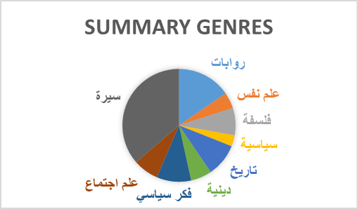

# 📚 SummARai v1.0: Long Chunk-Aligned Arabic Summarization Dataset

**SummARai v1.0** is a high-quality Arabic summarization dataset that provides **chunk-level alignment** between long Arabic texts and their corresponding **human-written summaries**. All content is written in **Modern Standard Arabic (MSA)**, making it suitable for formal and standardized Arabic NLP applications.

---

## 🗂️ Dataset Overview

- **Total samples**: 4328 text-summary pairs  
- **Genres**:  
  - 📘 **Books**: 3666 entries  
  - 📖 **Novels**: 662 entries  

  
   
  <em>Figure 1: Genre distribution in SummARai v1.0</em>

- **Language**:  
  - ✍️ 100% in **Modern Standard Arabic (MSA)**  

---

## 🔍 Sources of Data

To ensure diversity, quality, and coverage across literary domains, the dataset was compiled from three main sources:

### 1. Summarization Websites and Pages
Human-written summaries were collected via web scraping (`BeautifulSoup4`) from:
- [Rajooshow](https://rajooshow.com/)
- [KHKitab](https://www.khkitab.com/)
- [Engzketab](https://engzketab.com/)

### 2. Arabic Books
Full-text Arabic books were collected from:
- [Foula Books](https://foulabook.com/)
- [Hindawi Arabic Dataset on Hugging Face](https://huggingface.co/)
- [Noor Book](https://www.noor-book.com/)

